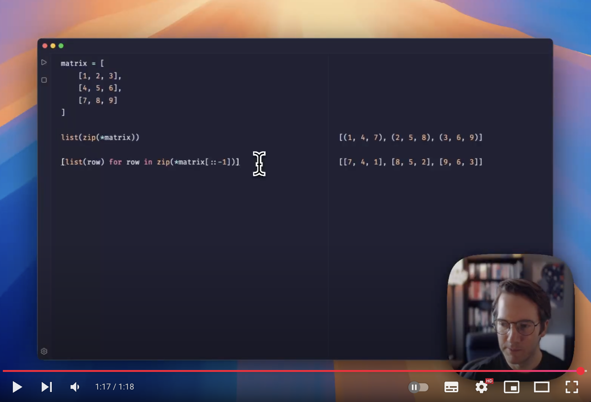

  <a href="https://runpy.app">
    
    <h1 align="center">RunPy</h1>
  </a>

[RunPy](https://runpy.app) is a batteries included Python playground from the creator of [RunJS](https://runjs.app).

## Links
- [Website](https://runpy.app)
- [Issue tracker](https://github.com/haaslabs/RunPy/issues)
- [Support](mailto:hello@runpy.app)
